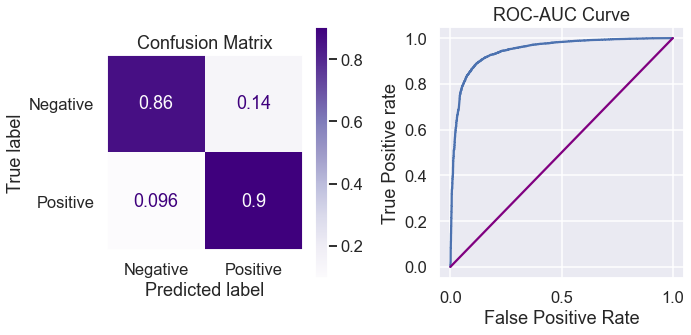
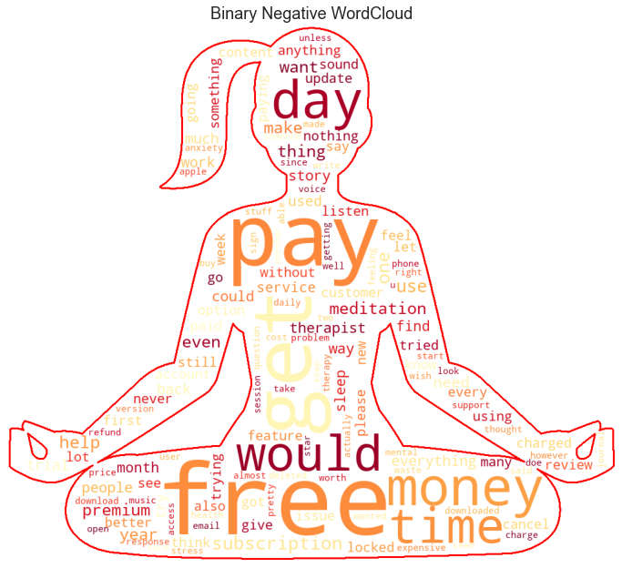
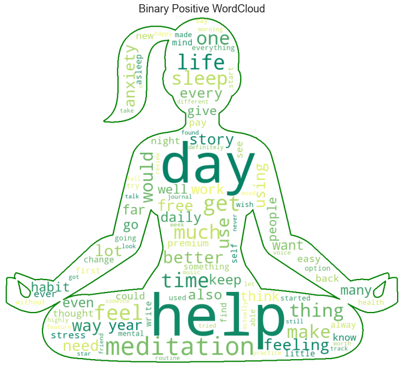
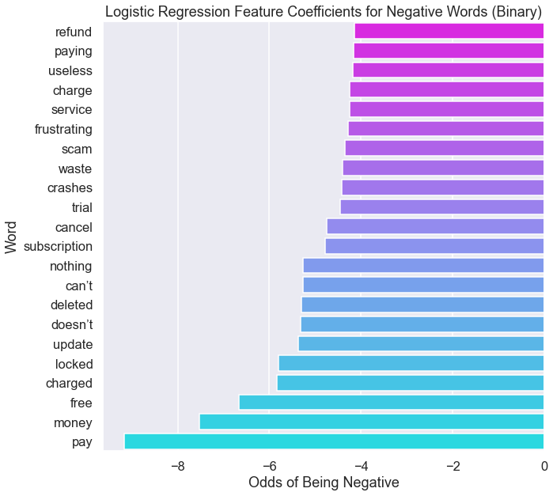
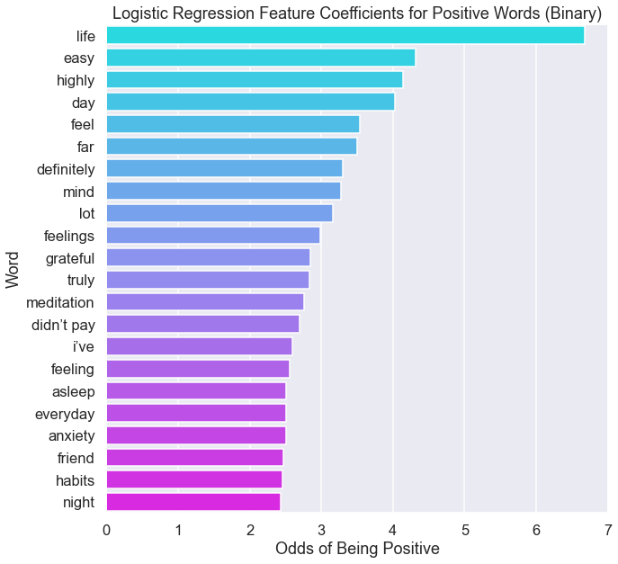
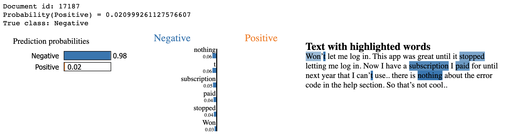
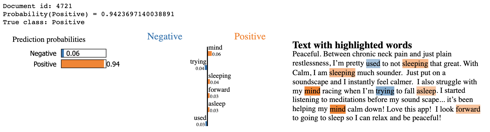
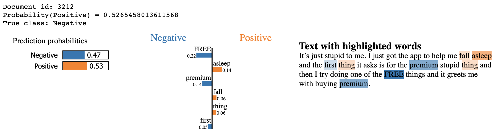

# Competing in the Mental Wellness iOS App Market (Natural Language Sentiment Analysis)

## INTRODUCTION

Over the course of the last year and a half, more and more COVID-19 lockdowns and restrictions were put in place, it's of no surprise that the number of people seeking help with anxiety and depression has skyrocketed. According to [Mental Health America](https://mhanational.org/issues/state-mental-health-america), there was a 93% increase in the number of anxiety screens and a 62% increase in the number of depression screens from January to September of 2020 in comparison to the total number of anxiety and depression screens recorded in 2019.

To make matters worse, lockdowns have made it increasingly difficult for those people to arrange to meet with health professionals who can provide the assistance that they seek. This is where Mental Health mobile apps have begun to provide an alternative approach. As a result, the mental health app market has seen tremendous growth, and [Market Watch](https://www.marketwatch.com/press-release/mental-health-apps-market-size-2021-by-share-industry-statistics-trends-evaluation-business-challenges-and-investment-opportunities-analysis-till-2027-2021-06-21) predicts the Mental Health app market to see a compound annual growth rate of 20.5% from 2021 through 2027 to reach $3.3 billion by 2027.

## Business Problem

Our stakeholder wants to enter the mental health mobile app market and requires insight into what to focus on while designing a new mental health app. With over 300,000 health apps currently available, there is plenty of information available to help us begin to form a strategy.

The goal of this analysis is to use Natural Language Processing to determine what characteristics of Mental Health apps currently available on the iTunes App Store are liked or disliked by users. Through sentiment analysis of text reviews and their corresponding ratings, we will examine what words are more likely to indicate a positive vs a negative app review.

***
Questions to consider:
* What do users like or dislike about apps currently available on the iTunes App Store?
* How can we use this information to develop a strategy for building a new mental health app that can compete with apps that have already seen success?
***

The full in-depth analysis can be found at the following links:
- [Data Collection Notebook](https://github.com/ds-leehanjin/app-reviews-nlp-sentiment-analysis/blob/master/data-collection.ipynb)
- [Main Analysis Notebook](https://github.com/ds-leehanjin/app-reviews-nlp-sentiment-analysis/blob/master/notebook.ipynb) 
- [Presentation PDF](https://github.com/ds-leehanjin/app-reviews-nlp-sentiment-analysis/blob/master/presentation.pdf)

## Data

Although there is a category for "Health and Fitness" apps, there is no subcategory for mental health apps, and so a list of 31 top mental health apps was hand-curated from a collection of blog posts. The data used in this analysis was scraped using the [itunes_app_scraper](https://pypi.org/project/itunes-app-scraper-dmi/) and [app_store_scraper](https://pypi.org/project/app-store-scraper/) libraries and includes text reviews for this list of mental-health apps paired with ratings out of 5.

A total of 44,698 reviews are considered for this sentiment analysis as independent variables, and the target variables will be the corresponding sentiments that are engineered according to the ratings given by reviewers.

## Methods

Prior to the actual analysis, we provide definitions of positive vs negative sentiments based on the ratings given by reviewers. We explore a multi-class case where 1-2 star ratings are considered negative, 3 star ratings are considered neutral, and 4-5 star ratings considered positive. We also explore a binary case where 1-3 star ratings are negative and 4-5 star ratings are positive.

In this analysis, we will begin by walking through an Exploratory Data Analysis phase where we identify the best way to preprocess our text reviews prior to modeling. During this phase, we examine techniques including tokenization, lemmatization and stopword removal in order to analyze word frequencies. This gives us a rough idea of what words occur commonly in reviews of negative vs positive sentiments.

During the modeling phase, we vectorize the review texts including individual words and bigrams as our features. Although this analysis explore Logistic Regression models, Random Forest models, and Support Vector Classifcation models combined with gridsearches, we find that Logistic Regression and SVC models yield the highest F1 harmonic mean scores. It was also found that the binary classification models had considerably better performance than the multi-class models. Lastly, in order to address the class imbalance problem, we use the balanced class weight parameter in each of our models.

### Best Model Summary
The overall best performing model was the binary Logistic Regression model with a F1 score of 0.89. This model had a recall score of 0.86 in predicting negative sentiment and 0.9 in predicting positive sentiment.

    ****TRAIN VS TEST ACCURACY****
    
     Training Score: 0.94 
     Test Score: 0.89 
    
    ****CLASSIFICATION REPORT - TEST DATA****
                  precision    recall  f1-score   support
    
               0       0.73      0.86      0.79      3064
               1       0.96      0.90      0.93     10346
    
        accuracy                           0.89     13410
       macro avg       0.84      0.88      0.86     13410
    weighted avg       0.90      0.89      0.90     13410
    
    ****CONFUSION MATRIX AND ROC-AUC VISUALIZATION****

## Findings

### WordClouds

The positive wordcloud we see above indicates that there are a variety of topics that users write about in their reviews. Note that we can see sleep seems to be one of the more important topics. However, it's much more obvious for the negative wordcloud that the majority of dissatisfaction that users have is either payment or customer-support related.

### Feature Analysis
  
Our binary Logistic Regression confirms that payment is a major issue, and through the words "response" and "crashes" further reinforces that customer support is also something to consider while addressing negative reviews.

For positive sentiments, we see another key indicator word "habits" which further illustrates that users appreciate being able to make the app a regular part of their routine. We also see the words "night" and "asleep", which confirm that sleep functionality is considered a highly positive app feature.

### Further Understanding the Model

Finally, we use the LIME package to help us better understand exactly how our binary Logistic Regression model is breaking down each review in the process of determining whether it is positive or negative.

In the above example, we can see that this user is unhappy with how he/she has been charged. This again points to the idea that we need to carefully consider how the user should be charged for the app, as well as what kind of support to provide to address this type of issue.

In this positive example, we can see that there are some words such as "pain", "restlessness" and "struggle" that seem negative. However, our model has determined that there are other words that have higher importance, including "mind", "sleeping", "forward" and "asleep" that carry much more weight in classifying this review as a positive one.

When we look at the text, it is obvious to us that the word "stupid" is an indicator of negative sentiment, but our trained model was unable to pick up on this word. Although it correctly determined that the words "free" and "premium" indicate a negative sentiment, our model also considers any mention of "fall" and "asleep" to be positive. The prediction probabilities indicate that the model was unable to easily determine that this was a negative review. This example shows us that although our model might make occasional errors in correctly predicting the overall sentiment, it does give us a good idea of what words and topics are considered positive or negative.

# CONCLUSIONS & RECOMMENDATIONS

Now, we return to the questions outlined in the Business Problem phase, which are:

> 1. What do users like or dislike about apps currently available on the iTunes App Store?
>2. How can we use this information to develop a strategy for building a new mental health app that can compete with apps that have already seen success?

First, we now know that the following topics are highly correlated with negative sentiment:
> - Payment and costs
>- Technical and customer support

These topics are considered highly associated with positive sentiment:
> - Sleep-aid functionality
>- Ease-of-use and regular use

Using these insights, we now have an idea of what elements to focus on when building a new mental health app to compete with other apps already on the market. My recommendations are as follows:
> 1. Since payment and costs seem to be a prevalent issue in negative reviews, app pricing and subscription fees needs to be well thought-out. Many reviews mentioned dissastisfaction in the "free" aspect of the app, indicating that they may have felt misled. We should address this issue by specifying at the time of download about what features of the app are free and what features are reserved for premium members. 
>2. Allocate sufficient resources toward thoroughly training the customer support team. Users expressed dissastisfaction in when their app crashed, as well as not having their payment issues properly resolved. We should make sure that customer support is trained to proficiently diagnose any technical issues as well as any payment-related issues users might experience.
>3. Invest in R&D of the sleep-aid functionality of the app. Users associated sleep-related words with positive sentiment, and this illustrates that an app's ability to become an effective sleeping aid can be a determinant factor of its overall effect on the user's mental health.
>4. Thoroughly develop the interface of the app to make it pleasant and easy to use. Users are likely to associate ease-of-use and the ability to make using the app a regular habit with positive sentiment, so the UI/UX designers will want to address this accordingly.

Some limitations and ideas for further analysis include:
>- We currently do not have any pricing data of apps. Further research and analysis could be done regarding pricing of subscription and app costs to determine what the best pricing scheme would be.
>- Our data is currently limited to the reviews and ratings on the Apple App Store. Collecting and analyzing app reviews from the Google Play Store to examine how they compare would help us get a well-rounded idea of the sentiments of all mobile app users, as opposed to just Apple users.
>- Possible implementation of Latent Dirichlet Allocation topic modeling to extract deeper insights on what topics could be found in negative vs positive reviews.

For the full in-depth analysis, please refer to the following files:
- [Data Collection Notebook](https://github.com/ds-leehanjin/app-reviews-nlp-sentiment-analysis/blob/master/data-collection.ipynb)
- [Main Analysis Notebook](https://github.com/ds-leehanjin/app-reviews-nlp-sentiment-analysis/blob/master/notebook.ipynb) 
- [Presentation PDF](https://github.com/ds-leehanjin/app-reviews-nlp-sentiment-analysis/blob/master/presentation.pdf)

Feel free to contact me at [lee.hanjin@gmail.com](mailto:lee.hanjin@gmail.com) with any further questions.